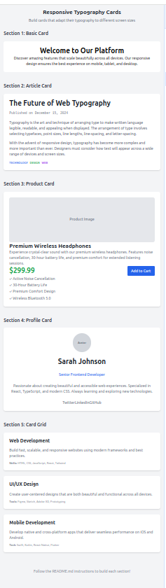
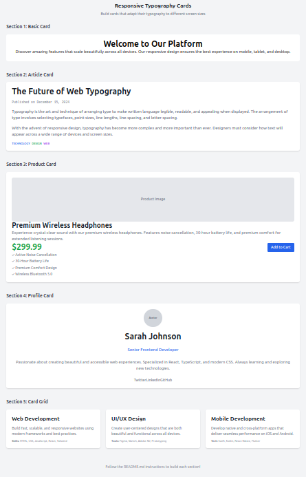
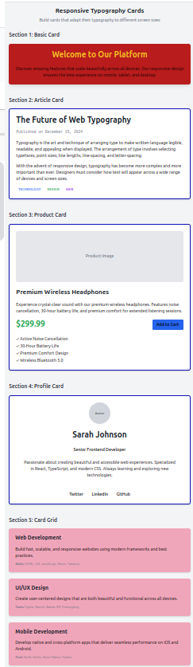
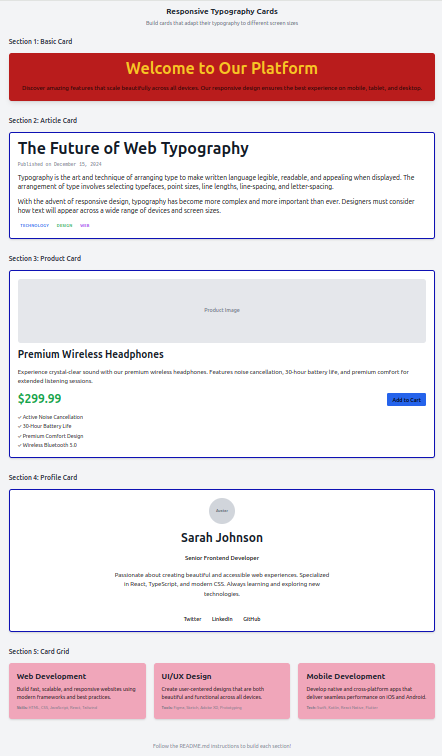

# Lesson: Tailwind CSS Theme Variables, Fonts, Text, and Typography

**Welcome!**  
This hands-on lab teaches you how to **build a professional, responsive design system** using **Tailwind CSS theme variables** — the modern way to manage colors, fonts, spacing, shadows, breakpoints, and more. You’ll create **consistent, reusable styles** and master **beautiful, adaptive typography** across all devices.

---

## Setup Instructions

### Prerequisites

- Modern browser (Chrome, Firefox, Edge)
- Code editor (**VS Code recommended**)
- Basic HTML/CSS knowledge
- **Node.js + npm** installed
- **Git** installed

---

### 1. Clone the Lab Repository

```bash
git clone https://github.com/onja-org/w2_tailwind_typography_lab.git
cd w2_tailwind_typography_lab
```

### 2. Install Dependencies

```bash
npm install
```

### 3. Start the Development Server

**Option 1: Live Server (Recommended)**

```bash

npm run dev

> # Opens a live-reloading browser tab at http://localhost:3000
> # Auto-refreshes on every save
```

**Option 2: Manual**

- Navigate to `lab/`
- Open `index.html` in your browser

### Testing

```bash
# Checks if all tasks pass
npm test
```

## 📁 Project Structure

```
 .
├── assets/                     
├── lab/
│   ├── <> index.html    
|   |── ℹ️ README.md     
│   ├── styles.css  
|   ├── js tailwind.config.js
|                    
│
├── lesson/
│   └── ⬇️ theme.md
|   └── ⬇️ typography.md  
│
├── node_modules/
│
├── tests/
|   └── tests/typography.test.js 
│        
├── ◌ .gitignore                 
├── {} package-lock.json       
├── {} package.json            
└── ℹ️ README.md                
 
```

### 1. Read the Lessons (10–15 mins)

| Topic               | File |
|---------------------|------|
| **Theme Variables** | [Read → `lesson/theme.md`](./lesson/theme.md) |
| **Typography & Text** | [Read → `lesson/typography.md`](./lesson/typography.md) |

> **Start here** to understand:
>
> - How to create **custom colors, spacing, and breakpoints**
> - How to generate **utility classes** like `bg-primary`, `p-card`
> - How to make **text scale perfectly** across devices

---

### 2. Complete the Lab Tasks (30–45 mins)

Now it’s time to **apply what you’ve learned**! Open the `lab/` folder and follow the step-by-step guide.

> **This lab has 2 focused tasks** — complete them in order.

---

#### Task 1: Build 5 Responsive Cards and Responsive Typography (`lab/README.md`)

**Goal**: Make **text adapt beautifully** across **all screen sizes** using Tailwind’s typography system.

**Instructions**:

1. Open [`index.htm`](./lesson/typography.md)
2. Complete the **interactive exercises**
3. Apply **responsive text classes** like:

   ```html
   <h1 class="text-xl sm:text-2xl md:text-4xl lg:text-5xl">
   ```

**Result**:  




---

#### Task 2: Master responsive, theme-powered cards(`lab/theme.md`)

**Goal**: Create a full set of **responsive, theme-powered cards** using your custom design system.

**Instructions**:

1. Open [`lab/theme.md`](./lab/theme.md)
2. Follow **each step** carefully
3. **Test after every change** — use browser dev tools (`Ctrl+Shift+I`) to check mobile/tablet views
4. Use **only your theme classes** (`bg-fill`, `text-muted`, `p-card`, etc.)

**Final Result**:  




> *All 5 sections: responsive, themed, bordered, and perfectly aligned*

---

### 🚨 Stuck? Check the Solution

```bash
git checkout solution
```

→ Opens **index.html** with the working version.

Switch back anytime:

```bash
git checkout main
```

> Tip: Study the code, then return and finish it yourself.
---

Happy learning!
