# Responsive Typography Cards Lab

A hands-on project for learning responsive typography with Tailwind CSS. You'll build different types of cards that adapt their typography to various screen sizes.

## 🚀 Getting Started

### Prerequisites
- Node.js installed on your computer
- Basic knowledge of HTML and CSS
- A code editor (VS Code recommended)

### Setup
1. **Install dependencies:**
   ```bash
   npm install
   ```
2. **Build Tailwind CSS:**
   ```bash
   npm run build
   ```
3. **Open the project:**
   - Open `index.html` in your browser
   - Or use a local server like Live Server in VS Code

---

## 📋 Project Overview

You'll build 5 different card types, each focusing on different responsive typography techniques. The instructions start with lots of guidance and gradually give you more independence as you progress.

1. **Basic Card** - Step-by-step, copy-paste, and class explanations
2. **Article Card** - Guided, but with some blanks for you to fill in
3. **Product Card** - Checklist and hints, less explicit code
4. **Profile Card** - High-level outline and requirements
5. **Card Grid** - Challenge prompt and success criteria only

---

## 🛠️ Section-by-Section Instructions

### Section 1: Basic Card (Full Guidance)

**Goal:** Create a simple card with a responsive title and description.

#### Step 1: Replace the placeholder content
Find this section in `index.html`:
```html
<section>
  ...
  <div class="bg-white rounded-lg shadow-md p-6">
    <!-- TODO: Add your basic card content here -->
    <p class="text-gray-500">Your card content will go here...</p>
  </div>
</section>
```
Delete the placeholder `<p>` and replace it with:

```html
<div class="text-center">
  <h3 class="text-lg sm:text-xl md:text-2xl lg:text-3xl font-bold text-gray-900 mb-3">
    Welcome to Our Platform
  </h3>
  <p class="text-sm sm:text-base md:text-lg text-gray-600 leading-relaxed">
    Discover amazing features that scale beautifully across all devices. Our responsive design ensures the best experience on mobile, tablet, and desktop.
  </p>
</div>
```

#### Step 2: Understand the classes
- `text-lg sm:text-xl md:text-2xl lg:text-3xl`: The title gets bigger on larger screens
- `font-bold`: Makes the title bold
- `text-gray-900`: Dark gray text
- `mb-3`: Margin below the title
- `text-sm sm:text-base md:text-lg`: Description text size increases on larger screens
- `leading-relaxed`: More line height for readability
- `text-gray-600`: Lighter gray for the description
- `text-center`: Centers all text


#### Step 3: Save and test
- Save the file and open in your browser
- Resize the window to see the text size change

Here is an example of what section 1 will look like in both a bigger and smaller field of view.

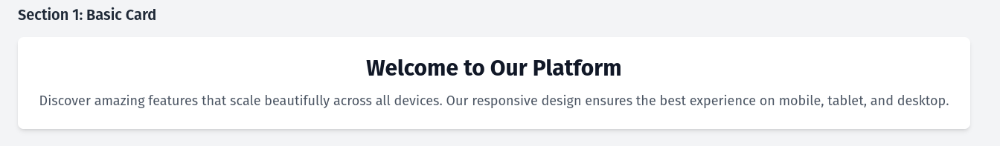
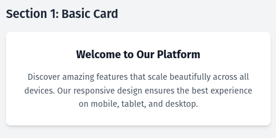

---

### Section 2: Article Card (Partial Guidance)

**Goal:** Create a blog post card with proper typography hierarchy.

#### Step 1: Add the article title and date
Replace the placeholder with this structure:
```html
<article class="space-y-4">
  <h2 class="text-xl sm:text-2xl md:text-3xl font-bold text-gray-900 leading-tight">
    The Future of Web Typography
  </h2>
  <p class="text-xs sm:text-sm text-gray-500 font-mono">
    Published on <time>December 15, 2024</time>
  </p>
  <!-- Add excerpt and tags below -->
</article>
```

#### Step 2: Add the excerpt
Below the date, add a paragraph with these classes:
- `text-sm sm:text-base md:text-lg` for responsive size
- `text-gray-700` for color
- `leading-relaxed` for line height

Example:
```html
<p class="text-sm sm:text-base md:text-lg text-gray-700 leading-relaxed">
  Typography is the art and technique of arranging type to make written language legible, readable, and appealing when displayed.
</p>
```

#### Step 3: Add tags (your turn!)
- Use a flex container with `flex flex-wrap gap-2`
- Each tag: `text-xs uppercase tracking-wide font-semibold` and a color like `text-blue-600`
- Add at least two tags (e.g., Technology, Design)

#### Step 4: Save and test
- Save and check your work in the browser
- Make sure the text sizes and spacing change as you resize

Here is an example of what section 2 will look like in both a bigger and smaller field of view.

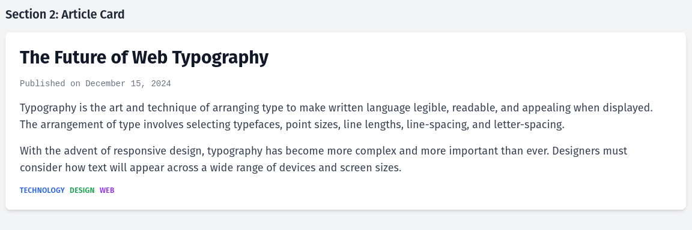
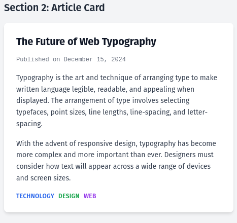

---

### Section 3: Product Card (Checklist & Hints)

**Goal:** Create an e-commerce product card with pricing and features.

#### Checklist
- [ ] Product image placeholder (gray box, centered text)
- [ ] Product title (responsive, bold)
- [ ] Product description (responsive, relaxed line height)
- [ ] Price (large, bold, green)
- [ ] Add to Cart button (responsive, blue, hover effect)
- [ ] Feature list (small, gray, checkmarks)

#### Hints
- Use `bg-gray-200 h-48 rounded-lg flex items-center justify-center` for the image placeholder
- For the price, try `text-xl sm:text-2xl md:text-3xl font-bold text-green-600`
- The button should have `text-sm sm:text-base font-semibold text-white bg-blue-600 hover:bg-blue-700 px-4 py-2 rounded`
- For the feature list, use `text-xs sm:text-sm text-gray-500 space-y-1` and add checkmarks (✓)

#### Try to write the HTML yourself! If you get stuck, look below for inspiration.

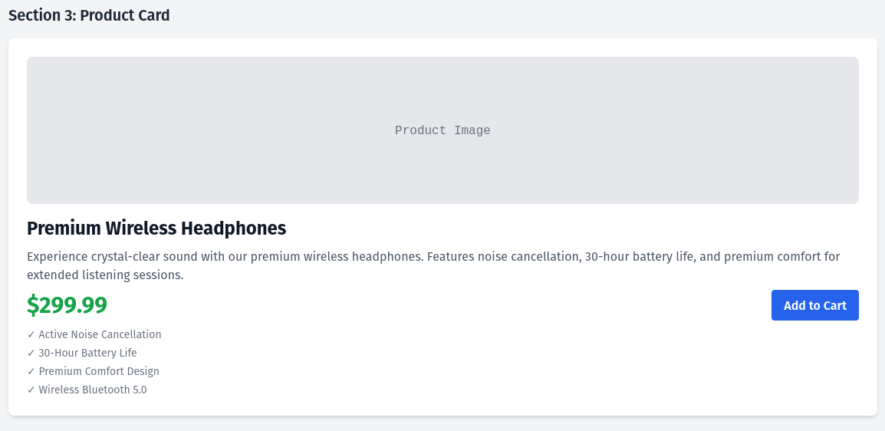
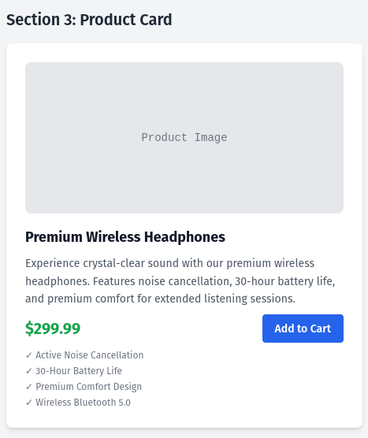

---

### Section 4: Profile Card (Outline & Tips)

**Goal:** Create a user profile card with personal information and social links.

#### Requirements
- Avatar placeholder (circle, centered)
- Name (responsive, bold)
- Job title (responsive, blue, semi-bold)
- Bio (responsive, gray, relaxed line height, max width)
- Social links (horizontal, hover color change)

#### Tips
- Use `rounded-full` for the avatar
- Center everything with `text-center` and `mx-auto`
- Use `space-y-4` and `space-y-2` for vertical spacing
- For social links, use `flex justify-center space-x-4` and `hover:text-blue-600`

#### Write the HTML for this section on your own. Test responsiveness as you go!

Here is an example of what section 4 will look like in both a bigger and smaller field of view.

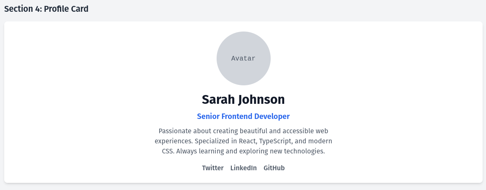
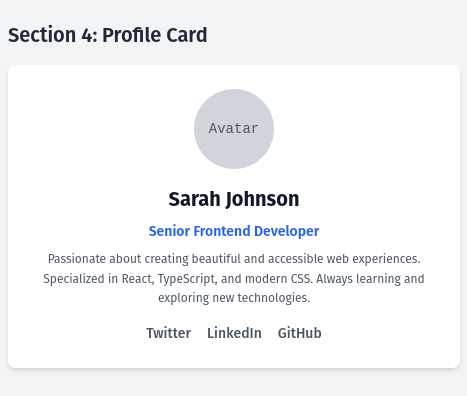

---

### Section 5: Card Grid (Challenge!)

**Goal:** Create multiple cards in a responsive grid layout.

#### Challenge Prompt
- Fill in the three placeholder cards with different content (e.g., Web Development, UI/UX Design, Mobile Development)
- Make each card responsive independently
- Ensure the grid layout works on all screen sizes
- Use consistent typography patterns across cards

#### Success Criteria
- [ ] Each card has a title, description, and a small info section
- [ ] All text is responsive
- [ ] The grid is 1 column on mobile, 2 on medium, 3 on large screens
- [ ] Consistent spacing and hierarchy

#### This section is up to you! Use what you’ve learned so far. Compare below when you're finished.

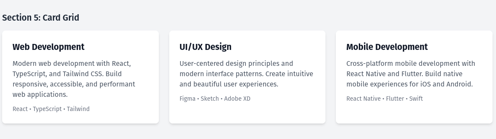
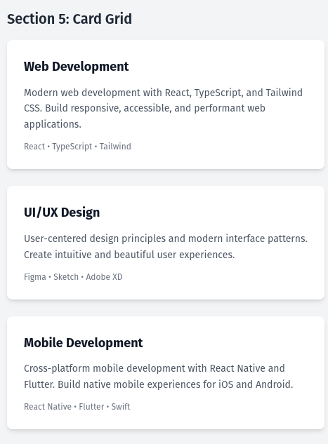

---

## 🎨 Typography Best Practices

- **Mobile-first:** Start with smaller sizes, scale up for larger screens
- **Headings:** Use `font-bold` or `font-semibold`
- **Body text:** Use `font-normal` or `font-medium`
- **Line height:** Use `leading-relaxed` for body, `leading-tight` for headings
- **Spacing:** Use Tailwind’s spacing scale for consistency

## 🧪 Testing Your Work

- Use browser DevTools to simulate different devices
- Test on real devices if possible
- Check readability, hierarchy, and accessibility

## 🚀 Advanced Challenges

- Add animations with `transition-` classes
- Add dark mode support with `dark:` prefix
- Improve focus states and ARIA labels for accessibility

<details>
<summary>Click here to view an idea of some of the bonus challenges!</summary>

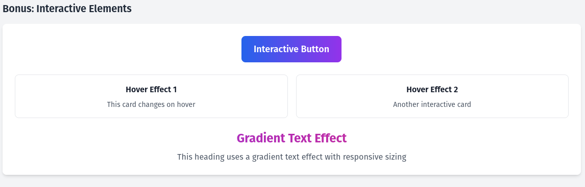
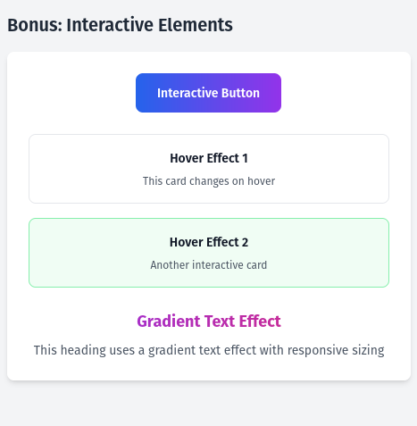
</details>

## 📚 Additional Resources

- [Tailwind CSS Documentation](https://tailwindcss.com/docs)
- [Typography Scale](https://type-scale.com/)
- [Web Typography Best Practices](https://practicaltypography.com/)

---

**Happy coding! Notice how you do more and more on your own as you progress. That’s how you learn best!**